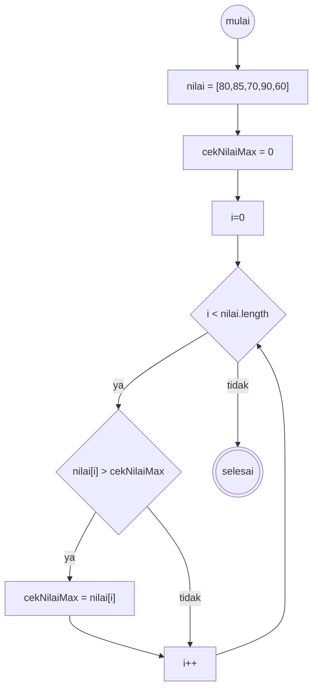
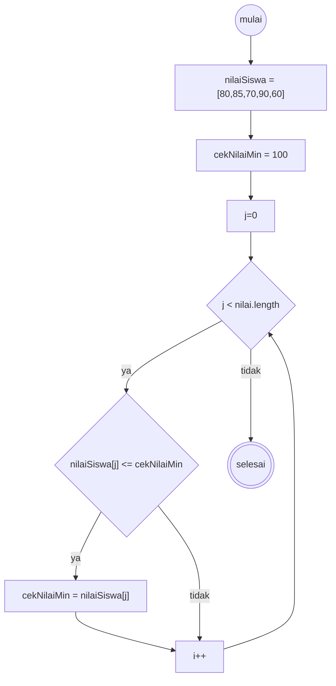

## Mencari Nilai Max

```mermaid
flowchart TD
    start((mulai)) --> NilaiArray["nilai = [80,85,70,90,60]"]
    NilaiArray --> deklarasi[cekNilaiMax = 0]
    deklarasi --> i[i=0]
    i --> cek{"i < nilai.length"}
    cek -- ya --> kondisi{"nilai[i] > cekNilaiMax"}
    cek -- tidak --> selesai(((selesai)))

    kondisi -- ya --> simpan["cekNilaiMax = nilai[i]"]
    simpan --> increament[i++]
    increament --> cek
    kondisi -- tidak --> increament
```

## nilai min

```mermaid
flowchart TD
    start((mulai)) --> NilaiArray["nilaiSiswa = [80,85,70,90,60]"]
    NilaiArray --> deklarasi[cekNilaiMin = 100]
    deklarasi --> i[j=0]
    i --> cek{"j < nilai.length"}
    cek -- ya --> kondisi{"nilaiSiswa[j] <= cekNilaiMin"}
    cek -- tidak --> selesai(((selesai)))

    kondisi -- ya --> simpan["cekNilaiMin = nilaiSiswa[j]"]
    simpan --> increament[i++]
    increament --> cek
    kondisi -- tidak --> increament
```
