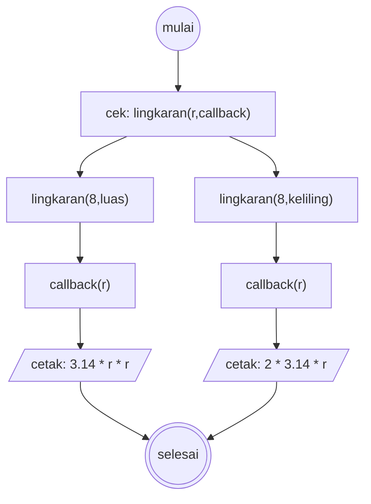

```mermaid
flowchart TD
    start((mulai))
    luas["lingkaran(8,luas)"]
    keliling["lingkaran(8,keliling)"]
    utama["cek: lingkaran(r,callback)"]
    callback1["callback(r)"]
    callback2["callback(r)"]
    cetakL[/cetak: 3.14 * r * r /]
    cetakK[/cetak: 2 * 3.14 * r /]

    start --> utama
    utama --> luas
    utama --> keliling
    luas --> callback1
    keliling --> callback2
    callback1 --> cetakL
    callback2 --> cetakK
    cetakL --> selesai(((selesai)))
    cetakK --> selesai


```
