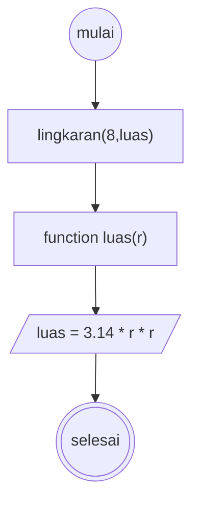
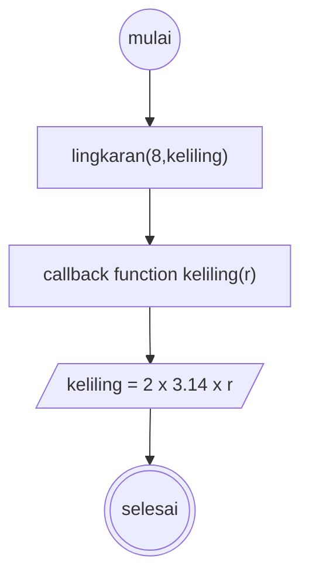

## Flowchart Callback

### Callback memanggil function luas

```mermaid
flowchart TD
    start((mulai)) --> luas["lingkaran(8,luas)"]
    luas --> menuju["function luas(r)"]
    menuju --> cetak[/luas = 3.14 * r * r/]
    cetak --> selesai(((selesai)))
```

### Callback memanggil function keliling

```mermaid
flowchart TD
    start((mulai)) --> luas["lingkaran(8,keliling)"]
    luas --> menuju[" callback function keliling(r)"]
    menuju --> cetak[/keliling = 2 x 3.14 x r/]
    cetak --> selesai(((selesai)))
```
