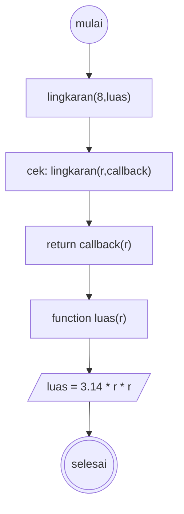

## Flowchart Callback
### ex:Callback memanggil function luas

```mermaid
flowchart TD
    start((mulai)) --> luas["lingkaran(8,luas)"]
    luas --> utama["cek: lingkaran(r,callback)"]
    utama --> callback["return callback(r)"]
    callback --> menuju["function luas(r)"]
    menuju --> cetak[/luas = 3.14 * r * r/]
    cetak --> selesai(((selesai)))
```
